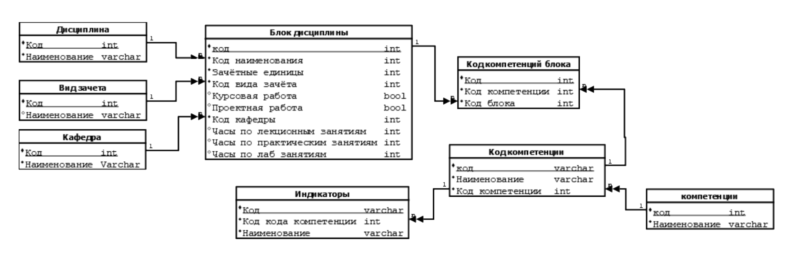

# Структура БД для карт учебного плана

База данных ``educational_plan`` приложения содержит схему ``public`` со следующими таблицами:

---

### Таблица `discipline`

**Описание:** Хранение информации о дисциплинах.

| Атрибут | Тип данных     | Ограничения          | Описание                  |
|---------|----------------|----------------------|---------------------------|
| `code`  | `INT`          | `PRIMARY KEY`        | Уникальный код дисциплины |
| `name`  | `VARCHAR(255)` | `NOT NULL`, `UNIQUE` | Название дисциплины       |

---

### Таблица `assessment_type`

**Описание:** Виды аттестации (зачеты, экзамены и т.д.).

| Атрибут | Тип данных    | Ограничения          | Описание                       |
|---------|---------------|----------------------|--------------------------------|
| `code`  | `INT`         | `PRIMARY KEY`        | Уникальный код вида аттестации |
| `name`  | `VARCHAR(11)` | `NOT NULL`, `UNIQUE` | Название вида аттестации       |

---

### Таблица `department`

**Описание:** Информация о кафедрах.

| Атрибут | Тип данных    | Ограничения          | Описание               |
|---------|---------------|----------------------|------------------------|
| `code`  | `INT`         | `PRIMARY KEY`        | Уникальный код кафедры |
| `name`  | `VARCHAR(50)` | `NOT NULL`, `UNIQUE` | Название кафедры       |

---

### Таблица `discipline_block`

**Описание:** Блоки дисциплин и их характеристики.

| Атрибут                | Тип данных | Ограничения                                    | Описание                  |
|------------------------|------------|------------------------------------------------|---------------------------|
| `code`                 | `INT`      | `PRIMARY KEY`                                  | Уникальный код блока      |
| `discipline_code`      | `INT`      | `NOT NULL`, `REFERENCES discipline(code)`      | Ссылка на дисциплину      |
| `credit_units`         | `INT`      | `NOT NULL`                                     | Зачётные единицы          |
| `assessment_type_code` | `INT`      | `NOT NULL`, `REFERENCES assessment_type(code)` | Вид аттестации            |
| `has_coursework`       | `BOOL`     | `NOT NULL`                                     | Наличие курсовой работы   |
| `has_project`          | `BOOL`     | `NOT NULL`                                     | Наличие проектной работы  |
| `department_code`      | `INT`      | `NOT NULL`, `REFERENCES department(code)`      | Ссылка на кафедру         |
| `lecture_hours`        | `INT`      | `NOT NULL`                                     | Часы лекций               |
| `practice_hours`       | `INT`      | `NOT NULL`                                     | Часы практических занятий |
| `lab_hours`            | `INT`      | `NOT NULL`                                     | Часы лабораторных занятий |

---

### Таблица `competency_indicator`

**Описание:** Индикаторы компетенций.

| Атрибут           | Тип данных     | Ограничения                                    | Описание                  |
|-------------------|----------------|------------------------------------------------|---------------------------|
| `code`            | `VARCHAR`      | `PRIMARY KEY`                                  | Уникальный код индикатора |
| `competency_code` | `INT`          | `NOT NULL`, `REFERENCES competency_code(code)` | Ссылка на компетенцию     |
| `name`            | `VARCHAR(100)` | `NOT NULL`, `UNIQUE`                           | Описание индикатора       |

---

### Таблица `block_competency`

**Описание:** Связь блоков дисциплин и компетенций.

| Атрибут           | Тип данных | Ограничения                                               | Описание              |
|-------------------|------------|-----------------------------------------------------------|-----------------------|
| `code`            | `INT`      | `PRIMARY KEY`                                             | Уникальный код связи  |
| `competency_code` | `INT`      | `NOT NULL`, `REFERENCES competency_code(code)`            | Ссылка на компетенцию |
| `block_code`      | `INT`      | `NOT NULL`, `UNIQUE`, `REFERENCES discipline_block(code)` | Ссылка на блок        |

---

### Таблица `competency_code`

**Описание:** Коды компетенций.

| Атрибут                      | Тип данных   | Ограничения                               | Описание                       |
|------------------------------|--------------|-------------------------------------------|--------------------------------|
| `code`                       | `VARCHAR`    | `PRIMARY KEY`                             | Уникальный код компетенции     |
| `name`                       | `VARCHAR(5)` | `NOT NULL`                                | Наименование кода              |
| `additional_competency_code` | `INT`        | `NOT NULL`, `REFERENCES competency(code)` | Дополнительный код компетенции |

### Таблица `competency`

**Описание:** Компетенции.

| Атрибут | Тип данных    | Ограничения   | Описание                   |
|---------|---------------|---------------|----------------------------|
| `code`  | `INT`         | `PRIMARY KEY` | Уникальный код компетенции |
| `name`  | `VARCHAR(20)` | `NOT NULL`    | Название компетенции       |

### IDEF1x ER-диаграмма:

